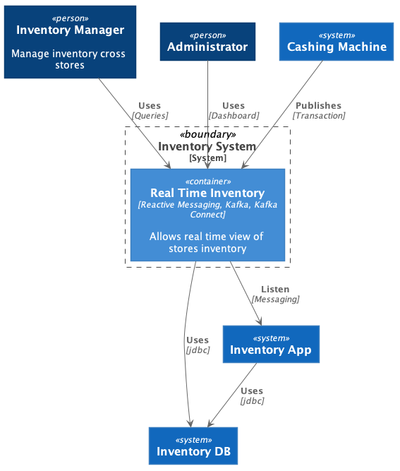
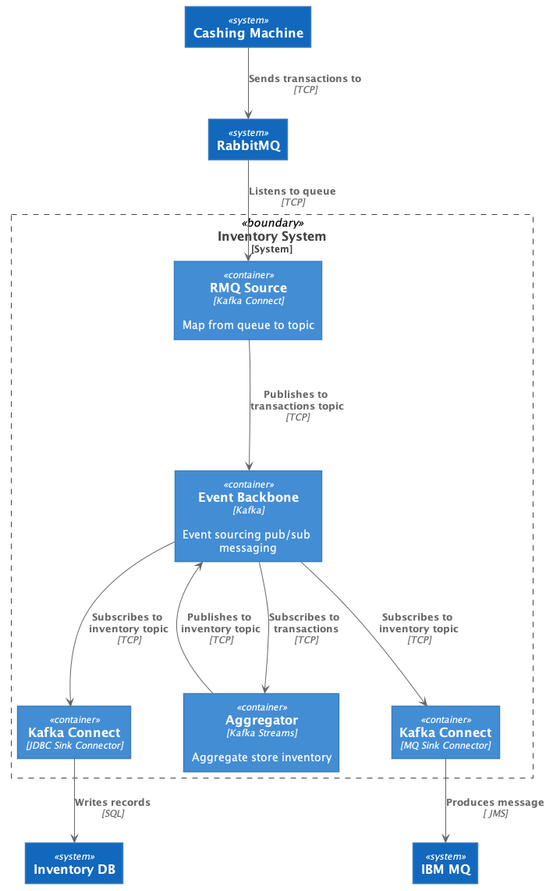

# Kafka Connect with Event Streams on Cloud

This repository includes a set of component to demonstrate some of the Kafka Connect connectors from the IBM Event messaging team.

We are using a classical, yet simple implementation of item consumption in store and centralized inventory using a simple real time streaming solution instead of batch based approach, as a lot of distribution industry companies are using today.

The system context looks like:



And the component view looks like:



See the [lab instructions](https://ibm-cloud-architecture.github.io/refarch-eda/technology/event-streams/kconnect/) in the EDA main repository for a step by step tutorial covering the different connectors used in the solution.

## Pre-requisites

The ultimate goal is to run all those components on an OpenShift cluster and use Cloud Pak for Integration with Event Streams and MQ instances.

For a solution running most of the component locally with Event Streams on Cloud, see the [lab instructions](https://ibm-cloud-architecture.github.io/refarch-eda/technology/event-streams/kconnect/).

## Build and run locally

We are providing docker compose files and maven pom to build and run the components locally for development purpose.

### Build

Do the following within this folder, to build each of the different modules

```shell
mvn build
```

### Build and configure connector

Under the `kconnect` folder we have a simple script to get the 3 connector to use, compile and package them, then copy jars for the connectors to the `kconnect/libs` folder. Once done the 3 configurations for each connector assumes to connect to a remote Event Streams cluster on cloud, and use RabbitMQ, Db2 and MQ locally.

The file `connect-distributed-TMPL.properties` is a template for the connection definition. Change the APIKEY and BROKERS end points, then rename the file as `connect-distributed.properties`.

Finally as we are using custom adaptor, we need to build a Kafka connector image:

```shell
docker build -t ibmcase/kconlab:1.0.0 .
```

### Run locally

Under the `infrastructure` folder we have different docker compose depending of the backend to start:

* `MQ-Kconnect-compose.yaml` for IBM MQ and the kafka connect.
* `RabbitMQ-Kconnect-compose.yaml` for Rabbit MQ wQ

### Rabbit MQ

Quick set of things to start and do:

```
# Start Rabbit mq and connect: under infrastructure
docker-compose -f  RabbitMQ-Kconnect-compose.yaml up
# Upload the connector configuration
curl -X POST -H "Content-Type: application/json" http://localhost:8083/connectors   --data "@./rabbitmq-source.json"
# Delete the connector
curl -X DELETE http://localhost:8083/connectors/RabbitMQSourceConnector
```

```shell
docker-compose up &
```

Deploy the connector with a POST to the connectors url

```shell
curl -X POST -H "Content-Type: application/json" http://localhost:8083/connectors   --data "@./mq-sink.json"
# To delete the connector
curl -X DELETE  http://localhost:8083/connectors/mq-sink
```

```
docker exec -ti ibmmq bash
bash-4.4$ /opt/mqm/samp/bin/amqsget INVENTORY QM1
Sample AMQSGET0 start
message <{"storeName": "NYC02", "itemCode": "IT02", "quantity": 11, "price": 113, "id": 0, "timestamp": "15-Jun-2020 23:56:30"}>
no more messages
```

### Some troubleshouting 

* Be sure to have set the consumer and producer credential in the kafka connector, if not you will get a broker disconnection.
* Be sure to specify the good hostname for the MQ server: `ibmmq` when running locally
* Entity 'admin' has insufficient authority to access object QM1 [qmgr].
* User ID 'app' authentication failed: add authentication info on DEV.AUTHINFO for the app user:


